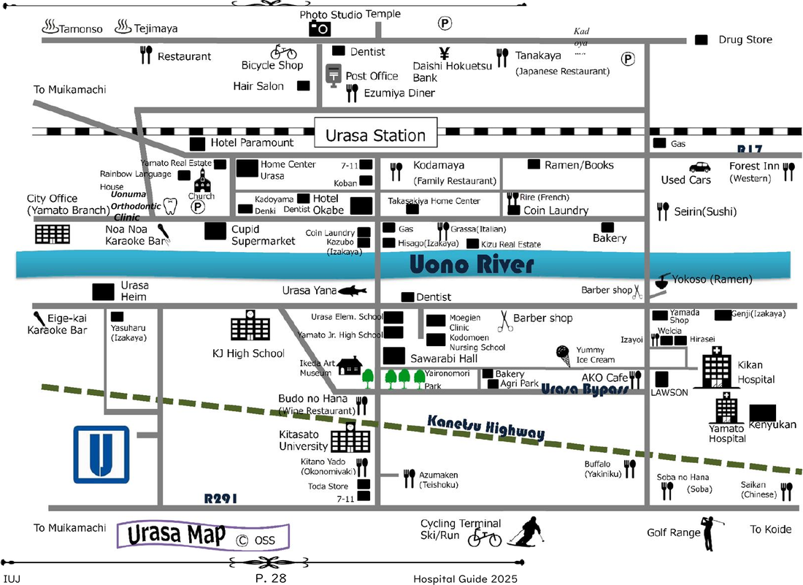

Urasa (浦佐) is a Shinkansen stop in the middle of rural Niigata. It's small, quiet, and has almost no English signage. Once you know the quirks, it's easy, but the first time can be disorienting.

---

## Getting from the Station to IUJ

### Option 1: IUJ Shuttle Bus *(Recommended for arrival day)*
- IUJ runs shuttle buses timed to Shinkansen arrivals. **Check the schedule on the IUJ student portal before you arrive.**
- Free for students
- ⚠️ Buses don't run on all trains or at all hours, so confirm your arrival train before booking

### Option 2: Taxi
- Taxis wait outside the East Exit (東口) of Urasa Station
- Fare to IUJ: ~¥1,000–1,500
- Takes ~10 min
- Useful when arriving late or on an unscheduled train

### Option 3: Walk
- ~25–30 min on foot, possible in good weather
- Not recommended on arrival day with luggage
- Not advisable in winter (snow, ice, poor footpaths)

---

## Station Layout & Key Points

- **East Exit (東口)**: the side facing IUJ and Minami-Uonuma town. Use this exit.
- **West Exit (西口)** faces the other side of the tracks and is less useful for students
- **Ticket gates** have IC card readers, but your Shinkansen ticket needs to be inserted or scanned separately from your IC card
- **Escalators and elevators** are available, which matters on arrival day with heavy bags

---

## IC Cards at Urasa

Urasa is on the IC card network but with limitations:
- IC cards work for **local trains** (JR Joetsu Line) to/from Urasa
- IC cards **do not** cover Shinkansen fares; those require a separate ticket
- Load IC cards at the ticket machines (supports English)

> 💡 Grab an IC card at any major station or convenience store before you arrive. See [[IC Cards — Suica & Pasmo Setup]].

---

## Luggage Storage (Coin Lockers)

- Coin lockers are available inside the station
- Sizes: small (¥300), medium (¥500), large (¥700) per day
- Useful if you want to explore Nagaoka/Niigata City before moving into dorm
- ⚠️ Limited number of large lockers, so don't count on them on busy days
- Payment: coins only at most lockers; some newer ones accept IC cards

---

## Shinkansen at Urasa

Only **Toki** services stop here, per IUJ's own current timetable.

| Train | Stops at Urasa? |
|---|---|
| Toki (とき) | ✅ Yes |
| Tanigawa (たにがわ) | Not listed as an Urasa-stopping service in IUJ's current timetable. Confirm before assuming. |
| Hakutaka (はくたか) | ❌ No |
| Kagayaki (かがやき) | ❌ No |

- Trains to **Tokyo**: ~1.5 hrs
- Trains to **Niigata City**: ~30 min
- Frequency: roughly every 30–60 min depending on time of day
- ⚠️ Late-night trains are sparse: the last Shinkansen to Urasa from Tokyo departs around 21:00–22:00. Check schedules on [HyperDia](https://www.hyperdia.com) or Google Maps.

---

## Nearby Convenience & Services

- **7-Eleven** is a short walk from the station, useful for snacks, cash (international ATM), and printing
- **Post Office** is a short distance away, useful for receiving packages
- No restaurants or major shops are at the station itself, so plan accordingly

*Urasa area map (© OSS), from IUJ's Hospital Guide 2025. Shop/restaurant names shown haven't been individually address-confirmed, so treat this as a rough orientation, not a verified directory.*

---

## Quirks & Pain Points

- **No English-speaking staff**: station staff are friendly, but communication will require Google Translate or pointing at your ticket
- **Platform confusion**: Shinkansen platforms are upstairs; local JR platforms are ground level. They are separate fare zones.
- **Snow season**: Urasa gets heavy snow (Nov–Mar). Platforms and exits are heated/covered, but the walk to taxis or buses can be icy. Wear appropriate footwear.
- **Taxis disappear at night.** Late arrivals should arrange pickup in advance or accept that a taxi won't be waiting.
- **Bishamon-do Temple** is reached via the **West Exit** (take Route 265, follow it as it curves right, temple's on your left). This is the site of the Hadaka Oshiai Matsuri ("naked pushing festival," 裸押合大祭) in early March, when men in loincloths push their way into the temple in the dead of winter. See [[Festivals — Campus & Local]] for the current date.

---

## Useful Numbers & Links
- JR East Timetable: [jreast.co.jp](https://www.jreast.co.jp/e/)
- HyperDia (train planner): [hyperdia.com](https://www.hyperdia.com)
- Google Maps works reliably for train timings in Japan

---

## Related Articles
- [[Airport to IUJ Routes]]
- [[IC Cards — Suica & Pasmo Setup]]
- [[Shinkansen Strategy]]
- [[First Week Checklist]]

---

## 🗣️ Senior Submissions
> *Have a tip, correction, or experience to add? Contact [your name/handle].*
