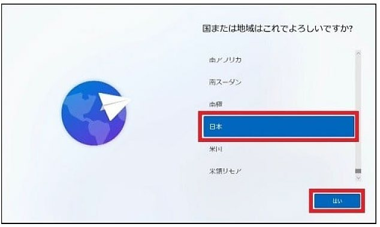
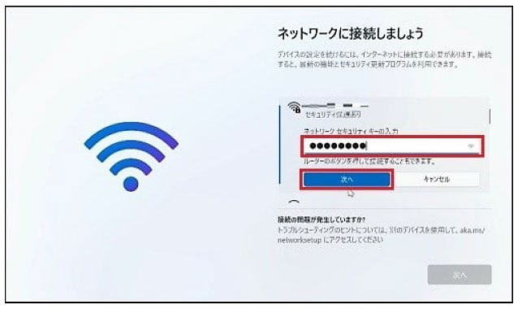
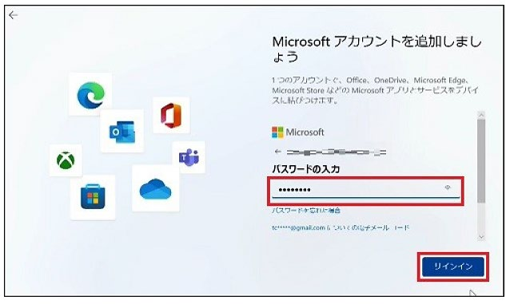
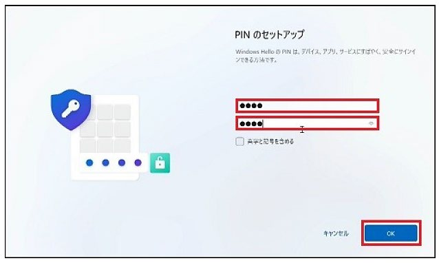
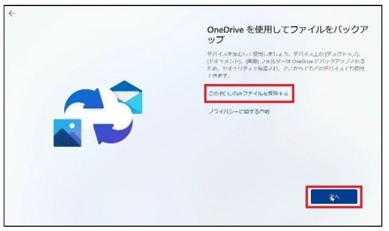
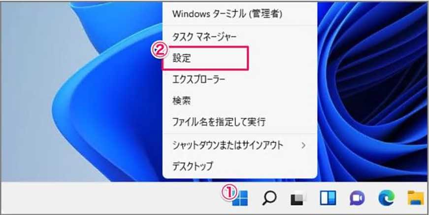
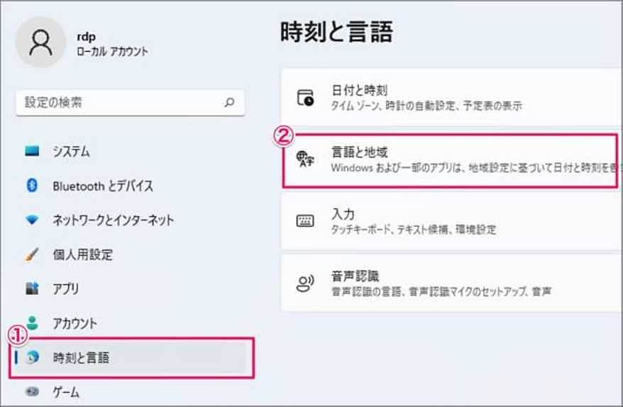
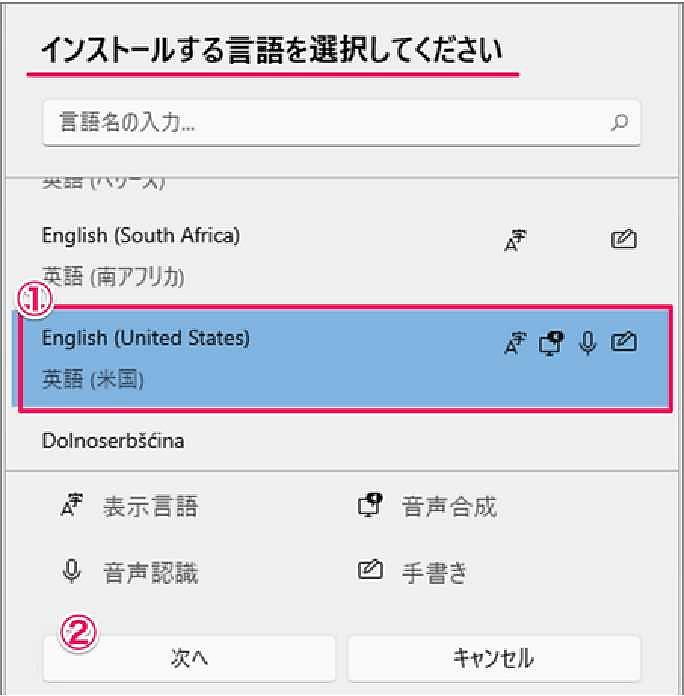
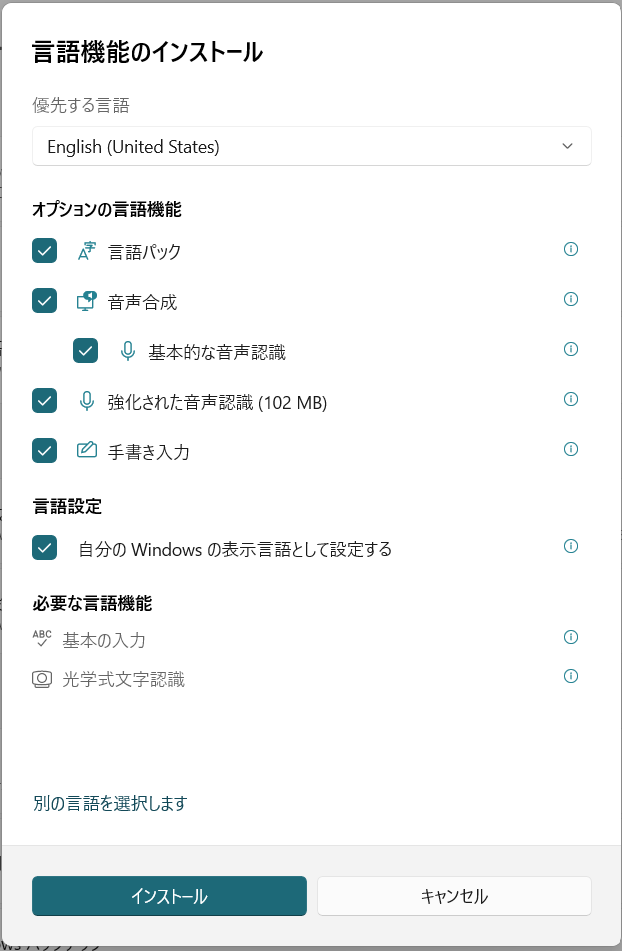

First-time setup for a new Windows 11 PC (relevant if you buy a laptop locally, e.g. at K's Denki, rather than bringing one from home). A network connection is required to get through setup — connect to **iuj-air1** if you're doing this on campus (see [[Campus WiFi & LAN Connection]]).

---

## Key Decisions During Setup

The wizard is mostly "click through," but a few screens are easy to get wrong:

- **Region/keyboard**: confirm Japan (日本) and Microsoft IME are selected if you bought the PC in Japan
- **Network**: select your WiFi SSID from the list. For **iuj-air1**, use your own IUJ ID/password. For a dorm hotspot (e.g. `SD1-2F-1`), use the common password instead.
- **Microsoft account email is NOT your IUJ email.** Use a personal address (e.g. Gmail) to create or sign into a Microsoft account. Mixing this up is a common early mistake.
- **PIN setup**: default is 4 digits; tick "Include letters and symbols" if you want an alphanumeric PIN (4–127 characters, must include more than a repeated/sequential pattern like `123456`)
- **OneDrive backup**: select **"Save files only on this PC"** unless you specifically want OneDrive sync — the default path silently starts uploading your files
- **Device naming, fingerprint setup, Game Pass, Acer registration screens**: all optional, safe to skip ("Skip for now" / "Not now")

Once the final automated setup finishes and the desktop loads, you're done. Don't disconnect power during this last step.

> These screenshots show the Japanese-language wizard (as PCs bought locally ship); the English wizard follows the same screens in the same order.

---

## Changing Display Language to English

If the PC ships in Japanese and you want an English interface:

1. Right-click Start → Settings → **Time and Language** → **Language & Region**
2. **Add Language** → select **English (United States)** → Next
3. Check all offered options (Language pack, Text-to-Speech, Basic/Enhanced speech recognition, Handwriting) and **✓ Set as my display language** → Install
4. Wait for installation, then **Sign out** when prompted

The interface switches to English on your next sign-in. Some Japanese text may persist in a few system dialogs even after this.

---

## Related Articles
- [[Campus WiFi & LAN Connection]]
- [[Available Software & Computer Rooms]]

---

## 🗣️ Senior Submissions
> *Have a tip, correction, or experience to add? Contact [your name/handle].*

- Any setup gotchas specific to PCs bought at K's Denki or other local retailers
