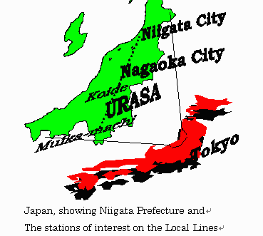

The IUJ campus bus is the primary way to get between campus and the outside world without a car. The network is limited but well-organised: knowing the routes and schedules is important because buses don't run all day.

*Where these places actually are, relative to Tokyo: Urasa is IUJ's own station; Koide and Muikamachi are the next stations over on the local lines.*

---

## The IUJ Campus Bus System

IUJ operates its own bus fleet (managed by the General Affairs Office / FT-OGA). This is not a public bus: it's an IUJ-run service for students and staff. Timetables are posted on campus and updated by email when they change.

The system runs on **named stops**, not route numbers. Key stops include:

| Stop | What's there |
|---|---|
| **Toda Store** | Convenience store, first stop after IUJ on every run |
| **Hospital** | Yukiguni Yamato Hospital; see [[Nearby Clinics & Hospitals]] |
| **Tenno-machi** | Near Moegi Clinic |
| **Station** (駅, Urasa Station) | Shinkansen access |
| **Supermarket** | Beisia supermarket, main grocery run |
| **City Office** (市役所) | Minami-Uonuma City Office and Daishi Hokuetsu Bank (now relocated inside the City Office building) |
| **Kodomo-en** | Local childcare facility, request-only; bus won't stop unless asked before departing IUJ |
| **MSA** | The MSA dormitory building; not all buses go here |

**Bus capacity is 32 passengers, including babies**: if a bus is full, wait for the next one. Large items (baby strollers, shelves, etc.) aren't allowed on board, except luggage when you're arriving at or departing IUJ for good. Arrive at your stop **5 minutes before** the posted time; times are approximate.

> ⚠️ **Timetables change.** The schedule below is effective from **June 8, 2026**; always check the current timetable at OSS or the campus notice board before relying on specific times.

---

## Weekday Buses

Effective June 8, 2026: **15 runs a day**, Monday–Friday, from the first (7:50 AM) to the last (10:10 PM departing IUJ, arriving back 10:44 PM). This already covers late returns; there's no separate "night bus" to wait for. Every run stops at Toda Store, Hospital, Tenno-machi, and Urasa Station; the Supermarket and City Office are only served by some runs (mid-day through evening), so check the current timetable for which. Kodomo-en is request-only.

---

## Weekend Shopping Buses

Separate weekend service to AEON (Saturdays) and Gyomu Super, near Koide (Sundays), in addition to a separate, more frequent regular bus to Urasa Station that also runs both weekend days.

- **Saturday AEON bus:** 4 fixed runs (not "once or twice depending on demand"); 1st bus priority goes to off-campus and SD4 residents.
- **Sunday Gyomu Super bus:** 6 fixed runs, with seating priority assigned by residency, not by which run you catch: **1st run**: off-campus families; **3rd, 5th**: off-campus & SD4 residents; **2nd, 4th, 6th**: on-campus residents. Earlier runs aren't simply "more capacity": they're reserved for specific resident groups.
- **To board a weekend bus:** get a ticket, distributed about **10 minutes before departure**. Your ticket shows your assigned priority seating for the return trip; board a different time than your ticket at your own risk, first-come-first-served ("Gentlemen's rules"), and if there's no seat, you're on your own to get back.
- Bus capacity is capped at 32 passengers (including babies) by law, same as weekday buses.

---

## Taxi

Available from Urasa Station. No Uber or rideshare in this area.

- Approximate fare: Urasa Station → IUJ ~¥1,000–1,500
- Essential for late-night returns when the bus isn't running
- No standing taxi service: arrange in advance for late returns or use whatever is at the station rank

---

## Getting Around Without a Car

**Practical hierarchy:**
1. **Bicycle**: best for Beisia runs, station trips in non-winter months. See [[Bicycle — Buying, Renting, Storage, Winter|Bicycle]]
2. **IUJ campus bus**: for Shinkansen travel, supermarket, City Office
3. **Weekend shopping bus**: AEON (Sat) and Gyomu Super (Sun)
4. **Carpool with a car-owning student**: often the most practical option for bigger trips or off-schedule errands. See [[Carpooling — Student Networks]]
5. **Taxi**: for emergencies and late nights

---

## Bus Rules

Students are reminded by OSS to:
- Board and exit only at designated stops, not mid-route
- Not cross in front of the bus at the last moment
- Keep the bus clean: no trash, no spills

Late-night driving imposes extra fatigue on drivers; the rules matter.

---

## Useful Japanese

| Japanese | Romaji | Meaning |
|---|---|---|
| バス停 | Basu tei | Bus stop |
| 時刻表 | Jikokuhyō | Timetable |
| 終バス | Shū basu | Last bus |
| 乗り換え | Norikae | Transfer |
| 市役所 | Shiyakusho | City Office |
| 駅 | Eki | Station |

---

## Related Articles
- [[IC Cards — Suica & Pasmo Setup]]
- [[Urasa Station — Full Guide & Quirks]]
- [[Shinkansen Strategy]]
- [[Bicycle — Buying, Renting, Storage, Winter|Bicycle]]
- [[Carpooling — Student Networks]]
- [[Local Grocery Options]]

---

## 🗣️ Senior Submissions
> *Have a tip, correction, or experience to add? Contact [your name/handle].*

- Confirm whether the June 8, 2026 timetable is still current, since these schedules change
- Local taxi company names and numbers for late-night situations
- Tips for getting around in winter when cycling isn't viable
