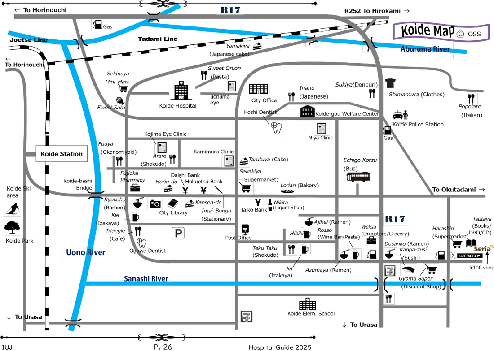
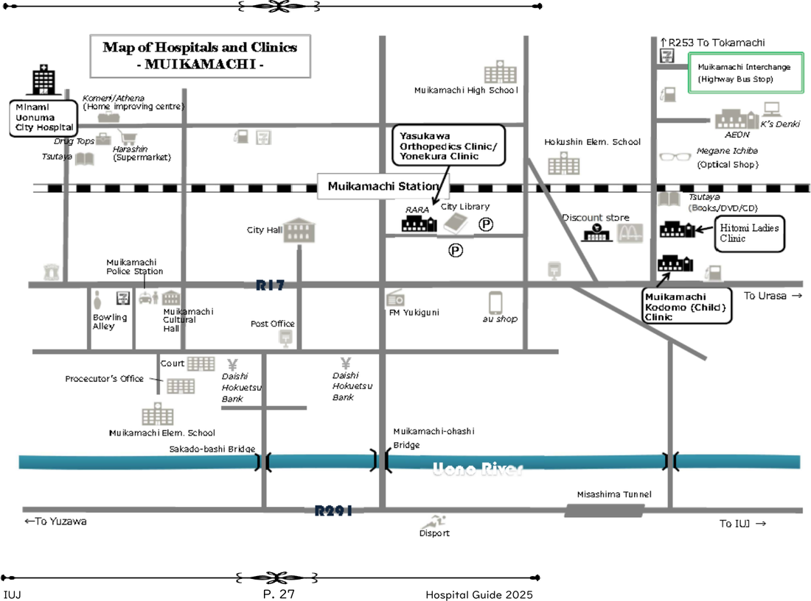

Knowing where to go before you're sick is important. Healthcare in rural Niigata is functional but limited. English support exists at a couple of specific places, and IUJ's own Hospital Guide centers everything around Uonuma Kikan Hospital, 10 minutes from campus (not Nagaoka).

---

## IUJ Health and Wellness Office

Officially the **Health and Wellness Office** (not "Health Centre"), staffed by a Health & Wellness Coordinator (registered nurse).

- **Hours:** Mon–Fri 9:00–12:30, 13:30–17:00, walk-in, no appointment needed
- **Location:** A-Wing Building, 1st Floor (behind the ATM)
- **Contact:** 025-779-1170 (ext. 170) / healness@iuj.ac.jp
- A school doctor also holds a monthly consultation for physical *and* mental health needs; watch for announcements about a week ahead of the visit, then book by the stated deadline (H&W has run this on the third Tuesday of the month, but the date and even weekday vary — check the actual announcement). It's guidance only: **no diagnoses, physical exams, or prescriptions**; the doctor helps you understand your symptoms and decide where to seek actual treatment. When booking, describe your symptoms clearly and in detail (not just one word)
- IUJ does **not** provide hospital escort services as a general policy (exceptions possible), and is not responsible for your family members' healthcare needs while visiting

**Use it for:**
- Minor illness, first assessment
- Referrals to local clinics or hospitals
- Mental health first contact (see [[Mental Health Resources]])
- Medical certificates for absences
- Annual health checkup (April and October, required under the School Health and Safety Act; one per year, fall term of your first year recommended)

---

## Local Clinics (近くのクリニック)

For standard illness (cold, flu, gastrointestinal issues, minor injuries), go to one of these two first (per IUJ's own Hospital Guide 2025, "It's best to have a regular doctor... such as at Yamato Hospital or Moegi Clinic. Do not go to Uonuma Kikan Hospital for basic health issues"):

**Yukiguni Yamato Hospital**
- 4115 Urasa, Minami-Uonuma-shi, Niigata 949-7302; 025-777-2111
- English-speaking doctor: Mon, Tue, Thu, Fri (internal medicine)
- Registration 8:30–10:00, consultation from 9:00; closed Sat afternoon, Sun, holidays
- Reachable by IUJ Bus (every run stops there on request) or ~4km taxi ride

**Moegi Clinic**
- 5363-1 Urasa, Minami-Uonuma-shi, Niigata 949-7302; 025-777-5222
- English-speaking doctor: Mon, Tue (AM), Wed, Thu (PM), Fri (AM)
- Hours: Mon–Fri 8:30–12:00 & 16:30–18:00, Sat 8:30–12:00
- ~5 min by car from IUJ, near Urasa Elementary School; IUJ Bus stops at "Tenno-machi," then walk

**General process at any Japanese clinic:**
1. Walk in or call for an appointment (walk-in is usually fine for minor illness)
2. Fill in a registration form (katakana name; bring Residence Card)
3. Present your NHI card (健康保険証), which reduces your cost to 30%
4. See the doctor; diagnosis is usually in Japanese, so use Google Translate or bring a translation app
5. Get a prescription (処方箋, *shohōsen*) if needed; fill it at a pharmacy nearby

**Useful vocab for the clinic:**

| Japanese | Romaji | Meaning |
|---|---|---|
| 頭が痛い | Atama ga itai | I have a headache |
| 熱があります | Netsu ga arimasu | I have a fever |
| お腹が痛い | Onaka ga itai | My stomach hurts |
| 喉が痛い | Nodo ga itai | My throat hurts |
| アレルギーがあります | Arerugī ga arimasu | I have an allergy |
| 処方箋 | Shohōsen | Prescription |
| 薬局 | Yakkyoku | Pharmacy |

---

## Uonuma Kikan Hospital

For anything beyond a local clinic's scope (specialist care, emergency care, referrals, or hospitalization), this is IUJ's actual designated hospital, not Nagaoka.

- 4132 Urasa, Minami-Uonuma-shi, Niigata 949-7302; **025-777-3200** (24/7 ER line)
- ~10 minutes by car from IUJ
- Registration 8:30–11:30 (walk-in) or 13:00–15:00 (by appointment); consultation 9:00–12:00 (walk-in) or 13:30–17:15 (by appointment)
- Some doctors speak English
- **Go with a referral if possible**, from Yamato Hospital, Moegi Clinic, or the IUJ school doctor. Without one, you pay an extra **¥7,700 for medical** or **¥5,500 for dental**, and face a long wait either way.
- Also handles pregnancy: Koide Hospital or Uonuma Kikan for checkups; **deliveries only happen at Uonuma Kikan**.

**Other hospitals in the area, for reference:**
- **Koide Hospital**: 34 Hiwatashi-shinden, Uonuma-shi, Niigata 946-0001; 025-792-2111
- **Minami Uonuma City Hospital**: 2643-1 Muikamachi, Minami-Uonuma-shi, Niigata 949-6680; 025-788-1222

**In a genuine emergency:** call 119 (ambulance). Free to call, no cost for the ride. See [[Emergency Contacts & Procedures]] for the exact calling script.

---

## Area Maps (Koide & Muikamachi)

For finding these hospitals/clinics on the ground, IUJ's Hospital Guide 2025 includes hand-drawn area maps:

*Koide area map (© OSS).*

*Muikamachi area map (© OSS), showing Minami Uonuma City Hospital and Hitomi Ladies Clinic.*

---

## Emergencies

**Ambulance (救急車):** Call **119**. Free service; no charge for the ambulance. Describe your location and situation; some operators have basic English or a translation service.

**Fire:** 119 (same number as ambulance in Japan)
**Police:** 110

For full emergency procedures, see [[Emergency Contacts & Procedures]].

---

## Dental

Basic dental is covered under NHI. For routine cleaning, fillings, or pain, local dentists are fine and affordable. Cosmetic dentistry is not covered.

Per IUJ's own guide, Yukiguni Yamato Hospital is the recommended first stop for dental (IUJ has an established relationship with them). Two dedicated dental clinics nearby:
- **Sato Dental Clinic**: 5421-4 Urasa, Minami-Uonuma-shi; 025-777-2872; Mon, Tue, Thu, Fri, Sat 8:30–12:00
- **Sawata Dental Clinic**: 1137 Urasa, Minami-Uonuma-shi; 025-777-4925; Mon, Tue, Wed, Fri, Sat 9:00–13:00 & 14:30–18:30
- **Uonuma Orthodontic Clinic** (orthodontic treatment only): 1918 Urasa, Minami-Uonuma-shi; 025-777-3770

All closed Sundays and national holidays; appointments required ahead of time.

---

## School Infectious Disease Policy

If you're diagnosed with an infectious disease, time away from class is recorded as a **Suspension of Attendance**, not a regular absence. This follows Japan's School Health and Safety Act. Common cases:

- **COVID-19:** stay home at least 5 days from symptom onset; return only after 24 hours symptom-free
- **Influenza:** stay home at least 5 days from symptom onset; return only after 48 hours fever-free

If infected: don't attend any in-person university activities, and notify both your lecturers and the Health & Wellness Coordinator.

---

## Pharmacy (薬局)

Prescriptions are filled at a pharmacy separate from the clinic; this is the standard Japanese system (clinics and pharmacies are separate). A pharmacy is usually nearby or in the same building complex as the clinic.

**OTC medications** are available at pharmacies and drugstore chains (マツモトキヨシ / Matsukiyo, ウエルシア, etc.) in Nagaoka. Basic cold medicine, pain relievers, and stomach remedies are easy to find.

---

## Mental Health

For mental health support specifically, see [[Mental Health Resources]], which covers both crisis resources and longer-term support options.

---

## Related Articles
- [[National Health Insurance]]
- [[Mental Health Resources]]
- [[Emergency Contacts & Procedures]]
- [[My Number Card — How to Get It & Why]]

---

## 🗣️ Senior Submissions
> *Have a tip, correction, or experience to add? Contact [your name/handle].*

- Current IUJ Health Centre hours and whether a doctor visits regularly
- Firsthand experience at Uonuma Kikan, Yamato Hospital, or Moegi Clinic: what actually happened
- Any tips for navigating Japanese medical appointments without Japanese fluency
