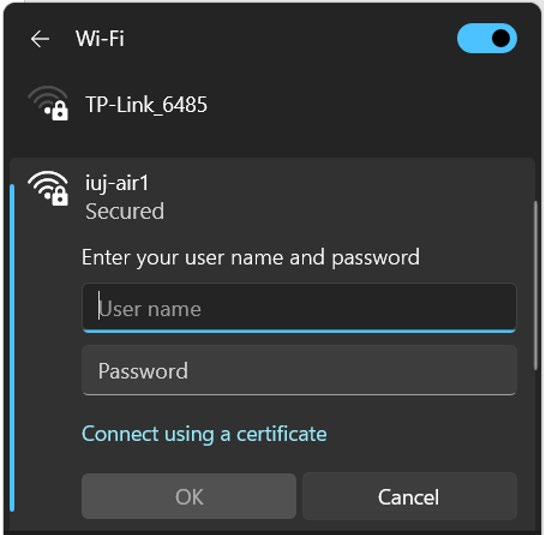
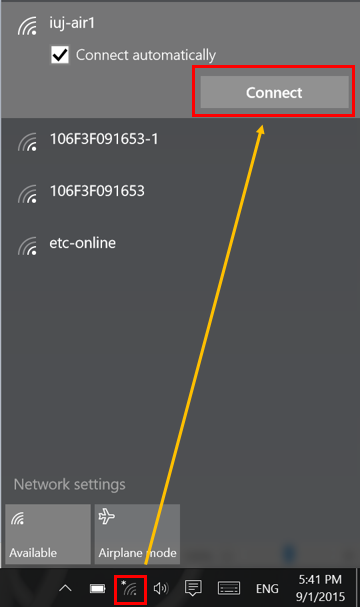
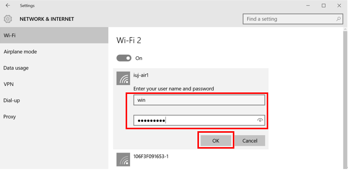
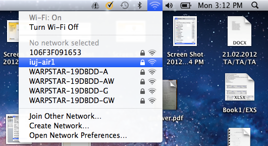
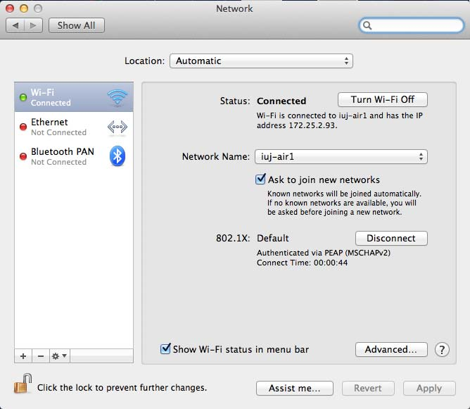
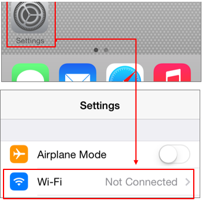
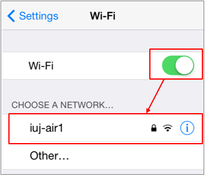
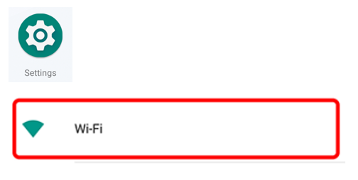
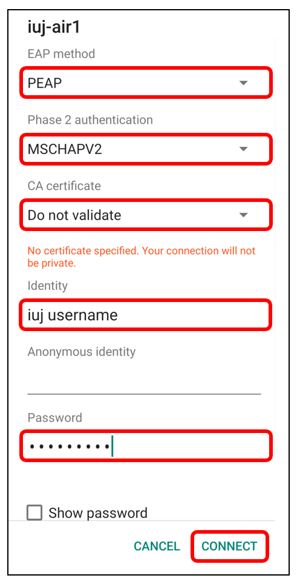

Campus-wide WiFi plus wired LAN in every dorm — both free with your IUJ network account. This covers SSIDs, passwords, wired outlet locations, and per-OS setup.

---

## Networks

| Network | Where | Login |
|---|---|---|
| **iuj-air1** (5GHz) / **iuj-air1g** (2.4GHz) | Campus-wide: PC rooms, classrooms, library, study rooms, snack lounge, school shop, gym, SD1/SD2/SD3, MSA, entrance lobby | Your IUJ username + network password |
| Classroom hotspots (e.g. `C101-Hotspot`) | Individual classrooms | Password posted on the room wall |
| Dorm hotspots (e.g. `SD1-1F-1`) | SD1/SD2/SD3, alongside iuj-air1 | Common password: `welcomeiuj` |
| `MSA-[room no.]` (e.g. `MSA-202`) | Married Students' Apartment, per-room | Password on the router in your room |

> 💡 iuj-air1 tops out around 11–100 Mbps depending on location; wired LAN in the dorms runs 1Gbps. If your WiFi feels slow, plugging in is a real upgrade, not a placebo.

---

## Wired LAN (Dorms)

Free for SD1/SD2/SD3 and MSA residents — you just need a LAN cable (borrow one from the MLIC office, or buy one at the school shop; MSA also has a LAN2 port available on the in-room WiFi router).

| Dorm | Outlet location |
|---|---|
| SD1 | Near the bathroom door |
| SD2 | Near the bathroom door |
| SD3 | Next to the desk |
| MSA | LAN2 port on the in-room WiFi router |

Plug the cable between your PC and the wall outlet (or router LAN2 port for MSA) — no login required for wired.

---

## Setup by Device

### Windows 11
1. Click the network icon (bottom-right taskbar) → the `>` arrow next to it
2. Select **iuj-air1** from the list → Connect (optionally tick "Connect automatically")
3. Enter your IUJ username and password → OK → Connect

### Windows 10
1. Click the network icon (bottom-right taskbar)
2. Select **iuj-air1** → Connect
3. Enter your IUJ username and password → OK → Connect

### macOS
1. Click the WiFi icon in the menu bar
2. Select **iuj-air1**
3. Enter your IUJ username and password → Join
4. Confirm via WiFi icon → Wi-Fi Settings… (shows "Connected" if successful)

### iPhone / iPad / iPod
1. Settings → Wi-Fi
2. Tap **iuj-air1**
3. Enter username and password → Join → Accept (certificate prompt)

### Android
> ⚠️ Some newer Android versions may fail to connect — this is a known limitation MLIC IT hasn't fully resolved.

1. Settings → Wi-Fi → turn on → tap **iuj-air1(5G)** or **iuj-air1g(2.4G)**
2. Set: EAP method = **PEAP**, Phase 2 authentication = **MSCHAPV2**, CA certificate = **Do not validate / No**
3. Identity = your IUJ username (before the `@`), Password = your network password → Connect

---

## Wifi Coverage Map

MLIC publishes a building-level coverage map showing which areas have WiFi (all PC rooms, classrooms, library, study rooms, snack lounge, school shop, gym, and all dorms). If you hit a dead zone somewhere on campus, it's worth checking the official map at the IT Helpdesk (MLIC 1F) before assuming your device is at fault.

---

## Trouble Connecting?

Contact IT Helpdesk (MLIC 1F): Phone ext. **527**, email **support-com@iuj.ac.jp**.

---

## Related Articles
- [[SIM & Internet Setup]]
- [[Printing & Scanning — Campus & Conbini]]
- [[Windows 11 Setup Guide]]

---

## 🗣️ Senior Submissions
> *Have a tip, correction, or experience to add? Contact [your name/handle].*

- Any dorm-specific WiFi dead zones or workarounds
- Whether the Android PEAP connection issue has been fixed for you
